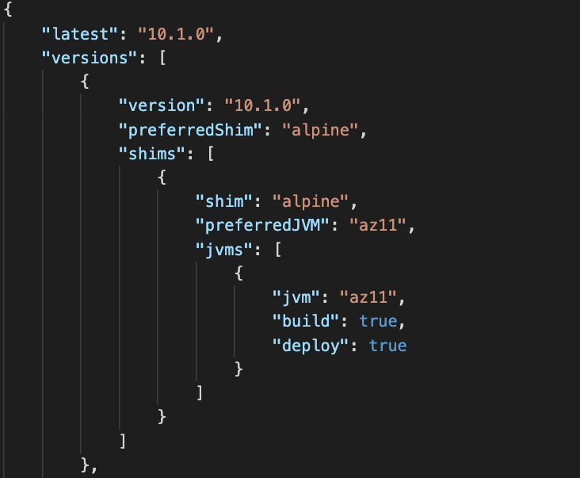

# Build a Docker Product Image Locally

This example describes how to build a Docker image or our products using the build tools found in our [Docker Builds](https://github.com/pingidentity/pingidentity-docker-builds) repo, and a local copy of a product zip file.

## Clone Build Repository

Open a terminal and clone the `pingidentity-docker-builds` repo. Enter:

```sh
git clone https://github.com/pingidentity/pingidentity-docker-builds.git
```

## Download a Product Zip File

1. Go to [Product Downloads](https://www.pingidentity.com/en/resources/downloads.html) and download the product you'd like to use to build a Docker image.

      > Ensure you download the product distribution zip file and not the Windows installer.

1. When the download has finished, rename it to product.zip. For example:

      ```sh
      mv pingfederate-10.1.0.zip product.zip
      ```

1. Move product.zip to the Build Directory

      In the `pingidentity-docker-builds` repo directory for each product. Move the `product.zip` file to the `<product>/tmp` directory, where /&lt;product&gt; is the name of one of our available products. For example:

      ```sh
      mv ~/Downloads/product.zip \
         ~/pingidentity/devops/pingidentity-docker-builds/pingfederate/tmp
      ```

## Building the Docker Image

Prior to building the image, display the `versions.json` file in the product directory. You'll need to specify a valid version for the build script. Since you're providing the product zip file, it doesn't really matter which version you select as long as it's valid. For example, you can see that `10.1.0` is a valid product version for PingFederate.



1. Go to the base of the `pingidentity-docker-builds` repo. For example:

      ```sh
      cd ~/pingidentity/devops/pingidentity-docker-builds
      ```

1. Our Docker images are built using common foundational layers that the product layer will need (such as, JVM, pingcommon, pingdatacommon). Because it's unlikely that you'll have the foundational layers locally, we'll build the product using the `serial_build.sh` script. Going forward, if you want to use the same foundational layers, you need only run the `build_product.sh` script to build the product layer.

   You'll need to specify the appropriate options when you run `serial_build.sh`. For PingFederate, the options might look like this:

   * -p (Product): pingfederate
   * -v (Version): 10.1.0
     * Note: this is the version retrieved from the **versions.json** file
   * -s (Shim): alpine
   * -j (Java): az11

   To build the image, run the `serial_build.sh` script with the appropriate options. For example:

   ```sh
   ./ci_scripts/serial_build.sh \
       -p pingfederate \
       -v 10.1 \
       -s alpine \
       -j az11
   ```

   > It's important that you build from the base of the repo as shown in the example.

   When the build is completed, the product and base images are displayed. For example:

   

## Re-Tagging the Local Image

You can change the tag of the created image and push it to your own Docker registry using the `docker tag` command:

```sh
docker tag [image id] \
    [Docker Registry]/[Organization]/[Image Name]:[tag]
```

For example:

```sh
docker tag a379dffedf13 \
gcp.io/pingidentity/pingfederate:localbuild
```


