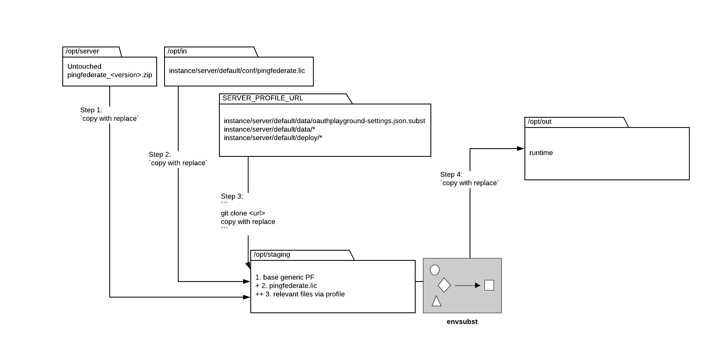

# Introduction

Any configuration that is deployed with one of our product containers can be considered a "server profile". A profile typically looks like a set of files.

## Server Profiles

Profiles can be used in these ways:

* Pulled at startup
* Build into the image
* Mounted as a container volume

### Pulled at startup

Pass a Github-based URL and path as environment variables that point to a server profile. If the container sees these variables (`SERVER_PROFILE_URL`, `SERVER_PROFILE_PATH`, and optionally `SERVER_PROFILE_BRANCH`), it clones the repo at startup to pull the profile into the container. There is additional customizable functionality.

This is the most common way that profiles are provided to containers, as it makes it very easy to track what is inside and avoids building. See [Private Github Repos](privateRepos.md) for more information.

Pros:

* Easily sharable, inherently source-controlled.

Cons:

* Adds download time at container startup.

### Built into the image

Build your own image from one of our Docker images and copy the profile files in. This is useful when you have no access to the Github repository, or if you're often spinning containers up and down. For example, if you made a Dockerfile at this location: https://github.com/pingidentity/pingidentity-server-profiles/tree/master/baseline, the relevant entries might look similar to this:

```shell
FROM: pingidentity/pingfederate:edge
COPY pingfederate/. /opt/in/.
```

Pros:

* No download at startup, and no egress required.

Cons:

* Tedious to build images when making iterative changes.

### Mounted as a Docker volume

Using `docker-compose` you can bind-mount a host file system location to a location in the container. This is useful when you're developing a server profile, and you want to be able to quickly make changes to the profile and spin up a container against it. For example, if you have a profile in same directory as your `docker-compose.yaml` file, you can add a bind-mount volume to /opt/in like this:

```shell
volumes:
   - ./pingfederate:/opt/in
```

Pros:

* Most iterative. There's no download time, and you can see the file system while you are working in the container.

Cons:

* There's no great way to do this in Kubernetes or other platform orchestration tools.

## Container resources

Because you can add profile information to our containers in a variety of ways, it's important to understand the resources and file structure used for our containers.

This is illustrated in the diagrams:

* Resources used at startup.
* How the resources work together.

## Resources used at startup


| Resource           | Description                                                                                                                                                                    |
| ------------------ | ------------------------------------------------------------------------------------------------------------------------------------------------------------------------------ |
| /opt/server        | This directory contains an untouched, uncompressed copy of the product software version.                                                                                |
| /opt/in            | This directory contains any server profile that you want Docker to mount to the container.                                                                                     |
| SERVER_PROFILE_URL | The URL referencing a Git clone of a server profile from a repository. Eventually merged to `/opt/staging`.                                                                    |
| /opt/staging       | The directory where the locations and resources mentioned above are moved to and evaluated (variable settings) before being moved to `/opt/out`.                               |
| envsubst           | The configuration data is passed to containers using environment variables. See [Env Substitution](profilesSubstitution.md) for information.                                   |
| /opt/out           | This directory contains the final, runtime location for all files. [Persist this directory](saveConfigs.md) to save any config changes you make in a running product instance. |

You can open a shell into a Docker container and view the container structure and resources by:

1. Entering `docker container ls` and getting the container ID displayed.

2. Entering `docker exec -it <container-id> /bin/sh`.

## How the resources work together



This is an example of a PingFederate flow illustrating:

* A common pattern where the PingFederate license is mounted as a file so that it is not stored in a repository. This mount could be a Docker mount, or it could be placed in the Docker image directly using a separate Dockerfile. This is also an acceptable approach for custom extensions and *.jar files.

* GitOps. Any additional profile files relevant to customizing the PingFederate configuration are pulled from a Git repository, for tracking, easy update, and maintenance.

* In `envsubst`, any remaining configurations needed for PingFederate to run are automatically set using the standard PingFederate environment variables.

See [Customizing Server Profiles](profiles.md) for more information about customizing deployments with profiles.
