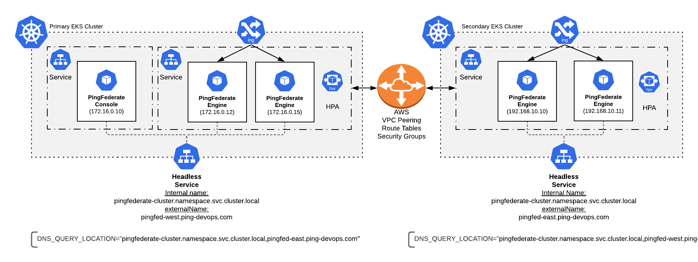

# PingFederate Cluster Across Multiple Kubernetes Clusters

This section will discuss deploying a single PingFederate cluster that spans across multiple Kubernetes clusters. 

Having PingFederate in multiple regions doesn't always mean that spanning a single across clusters is necessary or optimal. 
This scenario makes sense you have:
- Traffic that can cross between regions at any time. (us-west and us-east, and users may be routed to either)
- Configuration that needs to be the same in multiple regions **and** no reliable automation to ensure that

If all configuration changes are delivered via pipeline, and traffic wouldn't cross-regions, having separate PingFederate clusters can work. 

> Note: the extensive set of pre-requisites required for AWS kubernetes multi-clustering to be successful. An example set up of the pre-reqs is found [here](deployK8s-AWS.md)

## Overview

This section will focus on the optimal use of PingFederate features. Adaptive clustering and dynamic discovery of engines, to enable engine auto-scaling. Static engine lists, which may be used to extend traditional, on-premise PingFederate clusters is out of scope here.

There are two main dynamic discovery options: 

**For PF < 10.1.x Using S3**

  

**For GA PF 10.2 onward, Using DNS_PING**
  
  

In either scenario, some pre-reqs must be achieved

## Pre-reqs
- Two Kubernetes clusters created with the following requirements:
  - VPC IPs selected from RFC1918 CIDR blocks
  - The two cluster VPCs peered together
  - All appropriate routing tables modified in both clusters to send cross cluster traffic to the VPC peer connection
  - Security groups on both clusters to allow traffic for ports 7600 and 7700 to pass
  - Successfully verified that a pod in one cluster can connect to a pod in the second cluster on ports 7600 and 7700 (directly to the pods back-end IP, not an exposed service)
  > See example "AWS configuration" instructions [Here](deployK8s-AWS.md)
- envsubst
- kustomize

## Constants

In either scenario, some pieces will remain the same. 
Yaml files that include:

1. Two deployments:
    - `pingfederate-admin` represents the admin console.
    - `pingfederate` represents the engine(s)

1. Two Configmaps. One for each deployment.
    - These configmaps are nearly identical, but define the operational mode separately.

1. Profile Files: 
    - run.properties.subst
    - cluster-adaptive.conf.subst
    - tcp.xml.subst (using S3_PING, NATIVE_S3_PING, or DNS_PING)

1. Two Services:
    - One for each of the two deployments (9999 and 9031).

## Variables

For items specific to using S3 or DNS_PING follow the respective docs. 

- [PF < 10.1.x Using S3](deployPFMultiRegionAWS.md) (referencing AWS S3, with possible application to Azure)

- [GA PF 10.2 onward, Using DNS_PING](deployPFMultiRegionDNS.md)