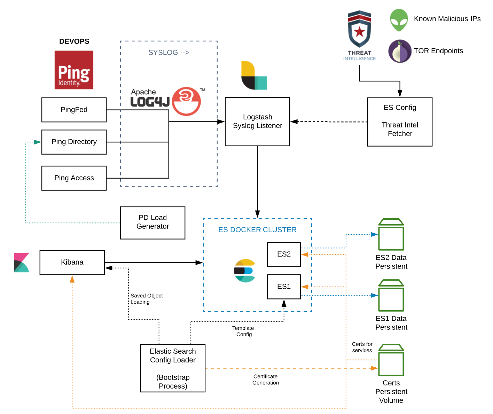

# Elasticsearch SIEM stack

This project will start a Ping Stack with Elastic Search Infrastructure built in for Visualizing traffic and other security / log data. Showing you the pipes.



* Threat Intel and TOR Endpoints are being provided by AlienVault and the TOR Network Endpoint List. 
* Threat Feeds are updated on an interval via setting a var in docker-compose 

> **Caution**: This stack is not intended for production environments.   

There are persistent volumes used for Elasticsearch data and certificates. You'll need to clear the volumes when you bring the stack down. Enter:

```shell
docker volume prune 
```

## Prerequisites


* For most Linux distributions, you'll need to increase the `vm.max_map_count` setting to support the necessary heap size. Enter:

  ```shell
  sudo sysctl -w vm.max_map_count=262144
  ```

  Your Linux machine needs at least 12 Gb of RAM for Docker to run this stack.

* For Apple macos or Microsoft Windows machines, ensure the Docker Resources is set to a *minimum* 10 Gb of RAM, or the containers will crash.

* For Amazon Web Services (AWS) use a M5.XL or M5a.XL VPC. 16 Gb RAM is required, and at least 50 Gb of storage is recommended.

### Optional

* If you're using Slack, you can generate a Slack Webhook URL from the Slack Admin for alerting: `https://api.slack.com/messaging/webhooks`.

## Inital setup for AWS

- To setup on AWS use a M5.XL or M5a.XL (16GB RAM REQUIRED // 50GB MIN STORAGE Recommended)
  - Install Docker / Docker Compose on your EC2 or Physical System
  - `sudo sysctl -w vm.max_map_count=262144` This step is required on linux systems.
- Clone this project to your Docker System.  
  - `git clone https://github.com/pingidentity/pingidentity-devops-getting-started.git`
- Within the Project change directory to the following path. `pingidentity-devops-getting-started/11-docker-compose/11-siem-stack/`
- Create and place a file `.env` in the above path and place these lines in it (UPDATE YOUR DEVOPS KEY AS SHOWN).

```
COMPOSE_PROJECT_NAME=es
ELASTIC_VERSION=7.6.1

ELASTIC_PASSWORD=2FederateM0re
ES_ADMIN_PD_USER_PASS=FederateTheB3st!

PING_IDENTITY_DEVOPS_USER={YOUR DEVOPS USER NAME HERE}       <====== NOTICE THIS
PING_IDENTITY_DEVOPS_KEY={YOUR DEVOPS KEY HERE}              <====== NOTICE THIS
```

## Deploy the stack

- Start the stack with `docker-compose up -d`  

- (Optional) Run the Slack configuration script to configure slack alerts `./config_slack_alerts`
  - The first time you must provide your webhook URL that you created above.
  - You can re-run this script any time which will update and push new watchers you create from the `./elasticsearch-siem/watchers` folder! 
  - You don't need to provide your webhook in the future. If you don't provide it, it simply will not update it.
  - The script asks for webhook URL and elasticsearch password.
    - The webhook URL updates the destination for your alerts within slack
    - The password is used to push watchers into elasticsearch

- Monitor the stack with `docker-compose logs --follow`

- Login to kibana at `https://localhost:5601/` (Wait for PingDirectory to full start)
  - The stack is now LDAP INTEGRATED so you can login with `es_admin` or `elastic` (local user) which is a user in PingDirectory (Password is in the .env file configuration listed above (ES_ADMIN_PD_USER_PASS). Allow time for Ping Directory to load.

------------

## Included Slack Alerts (these can be customized through Watchers)
 - User Authenticates over 1200km away within 6 hour period.
 - User Authenticates successfully from TOR through Ping Federate. (potential credential theft)
 - User Authenticates successfully from Known Malicious IP through Ping Federate. (potential credential theft)
 - Account Lockout detected through Ping Federate. (potential brute force)
 - Likely SAML Signature Modifications (Forced Tampering with Authentication Protocols)

------------


## Slack Alert Examples (not all are shown)

### Low / Medium / High Alert Examples


------------
## Dashboard Examples

### Demo Ping Federate Threat Intel Dashboard


### Demo Ping SIEM Dashboard (Beta 4) - More security use cases are coming soon.


### Ping Federate Demo Dashboard


### Demo Access Demo Dashboard


### Demo Directory Demo Dashboard


------------

## PingDirectory
- Audit Logs are being delivered
- There are 2 containers that produce load
  -These are disabled by default, uncomment in docker-compose.yml if you wish to use.
    - authrate_ok
    - authrate_ko

------------

## PingFederate
- Audit and System logs are delivered. (DEBUG by DEFAULT)

------------

## PingAccess
 - Audit and System Logs are being delivered. (DEBUG by DEFAULT)

------------

## Kibana Access
- Kibana listens on https://{IP}:5601

- DEFAULT PASSWORDS  
    - UN is configured as `es_admin` (LDAP USER)
    - PASSWORD is configured in your `.env` file 

------------

## Kibana Saved Objects
- Saved Objects can be loaded by going to 'saved objects' under kibana settings and exporting all. Save the file in the...  
	- `./elasticsearch-siem/kibana_config/kib_base.ndjson` 

------------

## ElasticSearch Templates for Indexes
- Index mappings and config are stored in the index_templates folder
- The Scripts will load this template(s) once cluster state is green.
	- ./elasticsearch-siem/index_templates/****

------------
## Logstash Pipeline
- TOR Enrichment
- Threat Intel (Alien Vault Provided)
- GEO IP Lookup
- GEO Distance Query (template driven)
- Data Parsing
- Logstash Pipeline is stored in the folder structure. It includes Parsers for All Ping Log Sources.

------------
## PingFederate (log4J)
- Ping Fed ships logs on 2 different SYSLOG PORTS, with a CUSTOM mappings.
------------

------------
## PingDirectory (log4J)
- Ping Fed ships logs on 1 SYSLOG PORT, with a CUSTOM mapping.
------------

------------
## PingAccess (log4J)
- Ping Fed ships logs on 2 different SYSLOG PORTS, with a CUSTOM mappings.
------------
