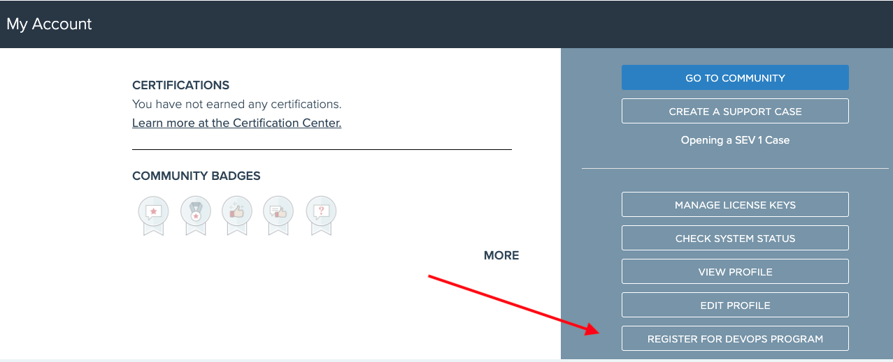

# DevOps Product Licenses

In order to run the Ping Identity DevOps images, a valid product license is required. There are several ways to obtain a product license to run the images:

#### Evaluation License

By registering for Ping Identity's DevOps program, you will be issued credentials that will automate the process of retreiving evalution product license.

!!! warning "Evaluation License"
    Please note that evaluation licenses are short lived (30 days) and should **not** be used in production deployments.

* [Obtaining a Ping Identity DevOps User and Key](#obtaining-a-ping-identity-devops-user-and-key)
* [Saving your DevOps User/Key](#saving-your-devops-user-and-key)
* [Using your DevOps User/Key](#using-your-devops-user-and-key)

#### Existing license

* [Mount Existing Product License](#mount-existing-product-license)

## Obtaining DevOps User and Key

Ping Identity will provide a DevOps Key to any user registered with Ping Identity. You must follow the steps listed below to obtain a Ping Identity DevOps User and Key

* Ensure you have a registered account with Ping Identity.  Not sure, click the link to [Sign On](https://www.pingidentity.com/en/account/sign-on.html) and follow instructions.
  * If you don't have an account, please create one.
  * Otherwise, sign-in.
  * When signing in select 'Support and Community' from the account type dropdown
  * Once logged in, you'll be directed to your profile [page](https://support.pingidentity.com/s/)
  * In the right-side menu, click the 'REGISTER FOR DEVOPS PROGRAM' button
  
  * You'll receive a confirmation message.
  * Your credentials will be forwarded to the email address associated with your Ping Identity account.

>Important: Upon receiving your key, ensure that you follow the instructions below for
saving these via the `ping-devops` utility.

Example:

* `PING_IDENTITY_DEVOPS_USER=jsmith@example.com`
* `PING_IDENTITY_DEVOPS_KEY=e9bd26ac-17e9-4133-a981-d7a7509314b2`

## Saving Your DevOps User and Key

The best way to save your DevOps User/Key is to use the Ping Identity DevOps utility `ping-devops`.

>Installation instructions for `ping-devops` can be found in the [Get Started](pingDevopsUtil.md) document.

Once `ping-devops` is installed and configured it will place your DEVOPS USER/KEY into a Ping Identity property file found at
`~/.pingidentity/devops`.  with the following variable names set (see example below).

```text
PING_IDENTITY_DEVOPS_USER=jsmith@example.com
PING_IDENTITY_DEVOPS_KEY=e9bd26ac-17e9-4133-a981-d7a7509314b2
```

You can always view these settings with the `ping-devops info` command after you've configured them.

## Using Your DevOps User and Key

When starting an image, you can provide your devops property file `~/.pingidentity/devops` or using the individual environment variables.

>The examples provided for standalone and docker-compose
are set up to use this property file by default.

For more detail, run the `ping-devops info` to get your DevOps environment information.

### Example Docker Run Command

An example of running a docker image using the `docker run` command would look like the following example \(See the 2 environment variables starting with **PING\_IDENTITY\_DEVOPS**\):

```sh
docker run \
  --name pingdirectory \
  --publish 1389:389 \
  --publish 8443:443 \
  --detach \
  --env SERVER_PROFILE_URL=https://github.com/pingidentity/pingidentity-server-profiles.git \
  --env SERVER_PROFILE_PATH=getting-started/pingdirectory \
  --env-file ~/.pingidentity/devops \
  pingidentity/pingdirectory
```

### Example YAML file

An example of running a docker image using any docker .yaml file would look like the following example \(See the 2 environment variables starting with **PING\_IDENTITY\_DEVOPS**\):

```yaml
...
  pingdirectory:
    image: pingidentity/pingdirectory
    env_file:
      - ${HOME}/.pingidentity/devops
    environment:
      - SERVER_PROFILE_URL=https://github.com/pingidentity/pingidentity-server-profiles.git
      - SERVER_PROFILE_PATH=getting-started/pingdirectory
...
```

### Example Inline Env Variables

An example of running a docker image using any docker .yaml file would look like the following example \(See the 2 environment variables starting with **PING\_IDENTITY\_DEVOPS**\):

```yaml
...
  pingdirectory:
    image: pingidentity/pingdirectory
    environment:
      - SERVER_PROFILE_URL=https://github.com/pingidentity/pingidentity-server-profiles.git
      - SERVER_PROFILE_PATH=getting-started/pingdirectory
      - PING_IDENTITY_DEVOPS_USER=jsmith@example.com
      - PING_IDENTITY_DEVOPS_KEY=e9bd26ac-17e9-4133-a981-d7a7509314b2
...
```

## Mount Existing Product License

You can pass the license file to a container via mounting to the container's `/opt/in` directory.

Note: You do not need to do this if you are using your DevOps User/Key. If you have provided license files via the volume mount and a DevOps User/Key, it will ignore the DevOps User/Key.

The `/opt/in` directory overlays files onto the products runtime filesystem, the license needs to be named correctly and mounted in the exact location the product checks for valid licenses.

### Example Mounts

#### PingFederate

* Expected license file name: `pingfederate.lic`
* Mount Path: `/opt/in/instance/server/default/conf/pingfederate.lic`

#### PingAccess

* Expected license file name: `pingaccess.lic`
* Mount Path: `opt/in/instance/conf/pingaccess.lic`

#### PingDirectory

* Expected License file name: `PingDirectory.lic`
* Mount Path: `/opt/in/instance/PingDirectory.lic`

#### PingDataSync

* Expected license file name: `PingDirectory.lic`
* Mount Path: `/opt/in/instance/PingDirectory.lic`

#### PingDataGovernance

* Expected license file name: `PingDataGovernance.lic`
* Mount Path: `/opt/in/instance/PingDataGovernance.lic`

#### PingCentral

* Expected license file name: `pingcentral.lic`
* Mount Path: `/opt/in/instance/conf/pingcentral.lic`

### Volume Mount Syntax

#### Docker

Sample docker run command with mounted license:

```sh
docker run \
  --name pingfederate \
  --volume <local/path/to/pingfederate.lic>:/opt/in/instance/server/default/conf/pingfederate.lic
  pingidentity/pingfederate:edge
```

Sample docker-compose.yaml with mounted license:

```sh
version: "2.4"
services:
  pingfederate:
    image: pingidentity/pingfederate:edge
    volumes:
      - path/to/pingfederate.lic:/opt/in/instance/server/default/conf/pingfederate.lic
```

#### Kubernetes

Create a Kubernetes secret from the license file

```sh
kubectl create secret generic pingfederate-license \
  --from-file=./pingfederate.lic
```

Then mount it to the pod

```sh
spec:
  containers:
  - name: pingfederate
    image: pingidentity/pingfederate
    volumeMounts:
      - name: pingfederate-license-volume
        mountPath: "/opt/in/instance/server/default/conf/pingfederate.lic"
        subPath: pingfederate.lic
  volumes:
  - name: pingfederate-license-volume
    secret:
      secretName: pingfederate-license
```
