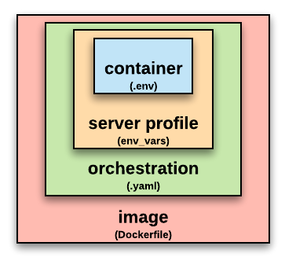
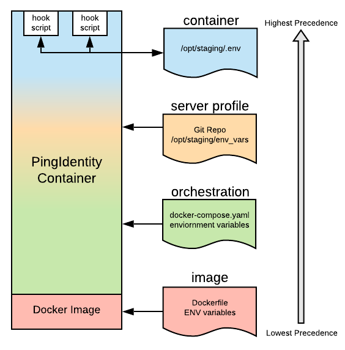

# Variable Scoping
DevOps variables provide a way to store and reuse values to docker containers, ultimately used by image hooks to customize configurations.

It is important to understand the diffrent levels that variables can be set
and how and where you should use them.  The diagram below shows the 4
different scopes that variables are set and used.  The primary scope that
a user of the Ping DevOps images should set variables is the orchestation
scope.  Below, there are examples of how variables can be provided to 
a container to set them.

## Image scope 
Defined with default values in the Docker Image (i.e Dockerfiles).  They are often set as defaults, allowing narrower scopes to override them.

* To see default ENV variables available with any docker image, run:

        docker run pingidentity/pingdirectory:edge env | sort

* Documenation can be found on the DevOps Gitbook.

  * Example pingdirectory: https://pingidentity-devops.gitbook.io/devops/dockerimagesref/pingdirectory

## Orchestration scope
Defined at the orchestration layer.  Typically these represent environment variables passed with docker commands, docker-compose yamls and kubernetes config refs. 

* Example with docker run (using --env)

        docker run --env SCOPE=env \
               pingidentity/pingdirectory:edge env | sort
      
* Example with docker run (using --env-file)

        echo "SCOPE=env-file"  > /tmp/scope.properties

        docker run --env-file /tmp/scope.properties \
               pingidentity/pingdirectory:edge env | sort
   
* Example with docker-compose (docker-compose.yaml excerpt)

        environment:
          - SCOPE=compose
            env_file:
          - /tmp/scope.properties

* Example with kubernetes (.yaml excerpt)

        env:
          - name: SCOPE
            value: kubernetes

* Example with kubernetes  (config or secret refs .yaml excepts)

        - envFrom:
          - configMapRef:
            name: kubernetes-variables
          - secretRef:
            name: kubernetes-secret

## Server Profile scope 
A property file provided by the server-profile repo.  Going forward
it is NOT RECOMMENDED as this overrides all Image/Orchestration variables,
unless an export with default value is used, as in this example where
LOG_LEVEL would only be set if not previously set (i.e. not set at 
image or orchestration scopes):

    export LOG_LEVEL=${LOG_LEVEL:=INFO}

There are some use cases when the env_vars can be used, such as, when the
developer of the server profile requires that a variable should be set to
a specific value to never be overridden by orchestration.

    Exmaple env_vars file
    SCOPE=env_vars

## Container scope 
Any variables defined in the hook scripts.  Variables that need to be passed to other hook scripts can append to ${CONTAINER_ENV}, 
(defined as /opt/staging/.env).  This file will be sourced for every hook.

# Example Scoping

